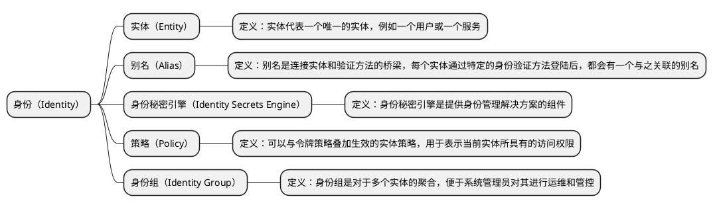
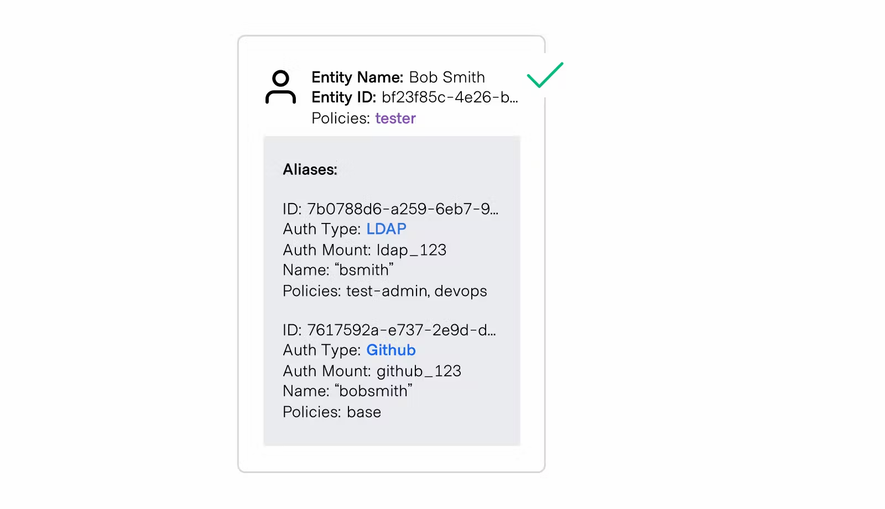
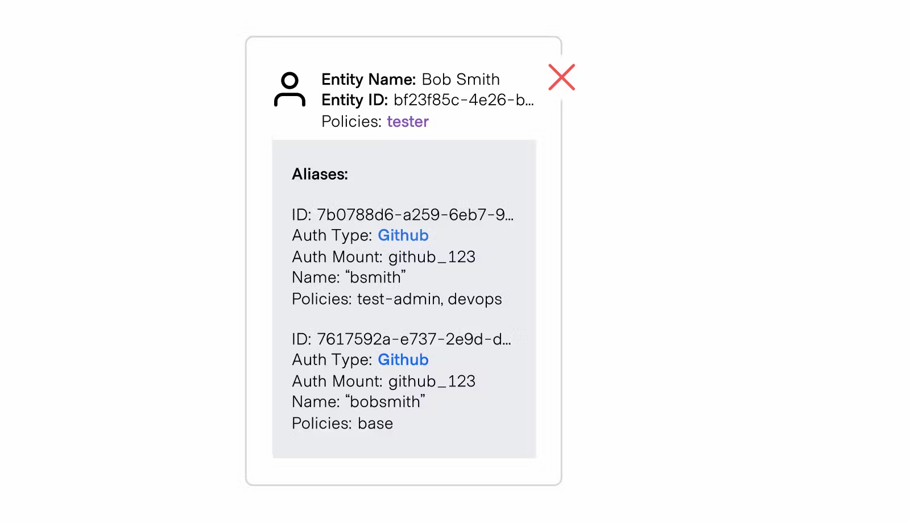
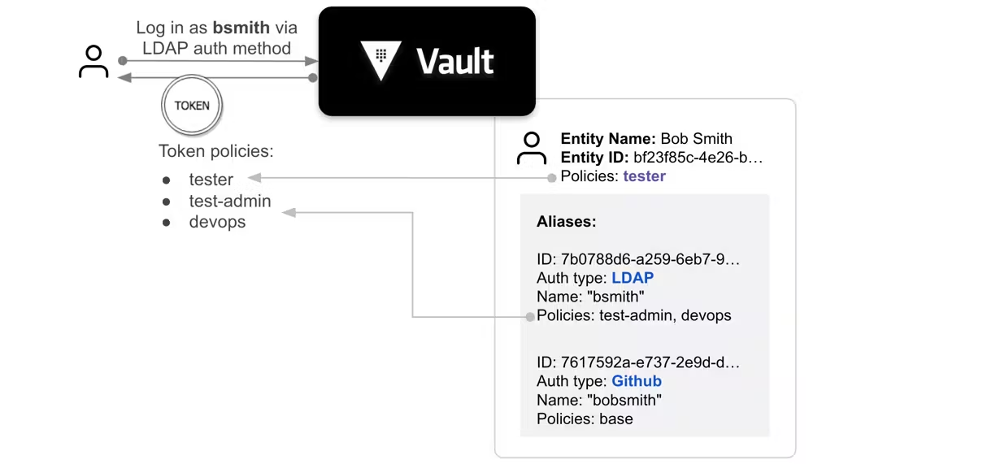
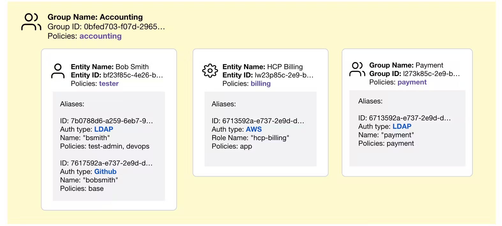

# 基础模型和概念
## 1. 概述
身份（Identity）在 Vault 中代表经过认证的客户端，其管理和维护由 “身份秘密引擎” 完成。对于有身份有两个核心关联模型，即 “实体（Entity）” 和 “别名（Alias）”。

## 2. 实体（Entity）和别名（Alias）
Vault 提供了对于多身份认证的能力，支持同一用户基于不同的身份供应商完成身份的认证操作。这主要是因为，用户（客户端）可能在多个不同的身份供应商内，都具有不同且独立的身份。但与此同时，虽然用户基于不同的身份完成了身份的认证，单其本质的操作主体还是同一个用户。

所以，Vault 身份机制支持将多身份认证获取到的不同身份，绑定映射到同一个对象实体上，而这个用于统一身份的对象实体就是 “Vault 实体（Entity）”。而与之相对应的，实体通过不同身份供应商的不同方式完成认证后，本次认证所基于的身份（身份供应商的账号）被称为 “Vault 别名（Alias）”。本质上，每个实体由零个或多个别名组成，且一个实体在一个特定身份认证后端，有且仅有一个别名。

例如，如果某用户同时在 GitHub 和 LDAP 中均有帐户，那他可以将它们映射到 Vault 中具有两个别名的同一个实体上，这两个别名一个是 GitHub 类型，另一个是 LDAP 类型，如下图所示：

但是，如果这两个别名是在同一个身份认证挂载（例如 Github 挂载）上创建的，则这两个别名无法映射到同一个实体。别名可以具有相同的身份认证类型（Auth Type），只要身份认证挂载的路径（Auth Mount）不同，就可以与同一实体进行关联。下图说明了有效和无效的情况。

当客户端通过任何方式（直接使用令牌除外）进行身份认证时，Vault 都会创建一个新的实体，如果实体没有别名，那 Vault 会为它附加一个新的别名。同时，实体标识符（Entity ID）会被绑定到身份认证通过后生成的令牌（Token）上，后续使用该实体基于令牌进行操作时，它们的实体标识符会被审计记录，用以标记特定用户执行的操作路径。

### 2. 身份秘密引擎（Identity Secrets Engine）
身份秘密引擎是 Vault 的身份管理解决方案，它在内部维护 Vault 认证完成的用户，每个客户端在内部被称为一个 “实体（Entity）”，一个实体可以有多个 “别名（Alias）”。例如，在 GitHub 和 LDAP 中同时拥有帐户的单个用户，可以映射到 Vault 中具有 2 个别名的单个实体，一个别名为 GitHub 类型，另一个别名为 LDAP 类型。

当客户端通过任何凭证后端（令牌后端除外）成功进行身份认证后，Vault 会创建一个新的实体并为其附加一个新的别名（如果相应实体尚不存在），但如果客户端之前已经进行过登陆，此时实体会被认为已经存在，所以 Vault 可能会直接更新实体，为新的登录方式生成一个新的别名，并将其绑定到已有的实体上。

实体会与经过身份认证后生成的令牌（Token）进行绑定，因此当该令牌投入使用后，它们的实体标识符将被记录在审计日志中，用以标记特定用户执行的操作的踪迹。身份存储允许操作员管理 Vault 中的实体，可以通过 ACL 的 API 创建实体并将别名绑定到实体，也可以在实体上设置策略，将功能添加到与实体标识符相关的令牌上。通过为实体授予权限，从而实现对令牌现有的权限进行的补充。

### 3. 实体策略（Entity Policies）
Vault 中的实体不会从任何地方自动同步身份信息，它需要由系统操作员显式进行管理，这样就可以灵活地管控同步到 Vault 的实体数量。从某种意义上说，Vault 将充当身份的缓存，而不是身份的来源。

Vault 策略（Policy）可以施加给实体，这将在令牌（Token）现有的策略上，进一步授予令牌额外的访问权限。比如，如果 API 请求携带的令牌，与某个实体相关联（包含某个实体的标识符），并且该实体被施加了一组策略，那么该携带该令牌的请求，也将有权限执行该实体策略所允许的操作。

这对计算令牌（Token）所拥有的权限策略（Policy）是一种范式转变。在引入身份之前，令牌上附加的策略名称是不可变的（但策略的内容可以修改），但通过引入实体策略，配合令牌上的一组不可变的策略名称，使得令牌所拥有的策略将在请求发送到 Vault 时，根据身份动态计算得出，这大大增强了控制已签发令牌行为的灵活性。

需要注意的是，实体上的策略只是一种授予额外权限的手段，而不是令牌策略的替代品，当计算令牌的完整权限集合时，如果它关联了实体，则需要把实体的策略和令牌上的附加策略一同进行考虑。

### 4. 身份组（Identity Group）
#### 4.1 实体对于组策略的继承
Vault 支持身份组，一个身份组可以包含多个实体作为其成员。同时，一个身份组可以有身份子组，在身份组上设置的策略，会被授予组内所有成员实体。在 Vault 处理请求时，计算令牌对应的实体所拥有的策略，此时因实体所属某个身份组而继承的策略，也会与实体本身的策略一起被附加到令牌上。

#### 4.2 身份组的继承
一个实体可以是一个身份组的直接成员，这时它将继承所有附加在该组上的策略。实体也可以是组的间接成员，例如，如果 GroupB 是 GroupA 的子组，则 GroupB 的成员是 GroupA 的间接成员。因此，GroupB 的成员将同时拥有附加在 GroupA 和 GroupB 上的策略。

#### 4.3 外部组与内部组
默认情况下，在身份存储中创建的组被称为 “内部组”，这些组的成员资格是手动管理的。但也可以创建 “外部组”，在这种情况下，组中的实体成员的资格是半自动管理的。

外部组就像是 Vault 身份机制之外的组，在 Vault 内部的一个映射。外部组可以拥有一个（并且只能有一个）别名。此别名应映射到身份机制之外的组的概念，比如说，LDAP 中的组和 GitHub 中的团队。属于某个 LDAP 组的 LDAP 用户名，可以在登录和令牌续期时，自动将其实体 ID 添加为 Vault 中的组的成员。这种机制只有在 Vault 中的组是外部组，并且有一个映射到了 LDAP 中的组的别名时才有效。如果用户被从 LDAP 中的组中删除，则该更改只有在后续执行登录或续约操作时，才会被反映在 Vault 中。

### 5. 其它
#### 5.1 挂载绑定别名（Mount bound aliases）
Vault 支持多种身份认证方式，也允许在不同的挂载路径（Auth Mount）上，启用相同类型（Auth Type）的身份认证方式。用户的别名在某一身份认证类型的挂载点上是唯一的，所以身份机制需要区分同一身份提供者，在不同挂载点上别名的冲突行为。因此，别名与身份认证挂载点的访问器结合起来，就成了区分别名的唯一标识符。

#### 5.2 隐式实体
系统管理员可以为某个身份验证挂载点上的所有用户预先创建对应的实体，并为其分配策略，以便在用户登录时，通过实体为令牌分配所需的权限。但如果没有这样设置，当用户从任何身份验证方法成功登录后，Vault 将创建一个新实体并之分配一个别名。

请注意，使用令牌身份验证后端创建的令牌通常不会具有任何关联的身份信息。使用配置了 allowed_entity_aliases 列表参数的令牌角色创建令牌时，可以使用 entity_alias 参数分配一个现有实体，或是隐式创建一个新实体。

#### 5.3 身份审计
如果关联了实体标识符的令牌被用于进行 API 调用，那么 Vault 会将之记录到审计记录里，这会留下特定用户执行操作的踪迹记录。

#### 5.4 身份租约（leasing）
与秘密（Secrets）一样，身份也有 “有效期” 和 “租约” 的概念，这意味着当身份失效时，需要重新进行身份认证，才能继续访问 Vault 服务。与秘密相同，身份也可以被续签，此时无需重新进行全流程的身份认证操作，只需使用 `vault token renew <token>` 身份关联的租赁令牌，即可完成身份的续签操作。

# 相关操作
## 1. 认证（Authentication）
身份认证是针对内部或外部系统，验证用户或计算机身份的过程。Vault 支持多种身份认证方法，包括 GitHub、LDAP、AppRole 等，每种身份认证方法都有特定的使用方法。

在客户端与 Vault 服务进行业务交互之前，它必须根据身份认证算法进行身份认证。身份认证通过后，Vault 服务会颁发一个令牌（Token），该令牌类似于网站上的会话 ID。同时，Vault 服务会对该令牌施加具体的访问权限控制策略（Policy），以明确该令牌具有的具体权限。

需要注意的是，令牌（Token）是与身份（Identity）强关联的，令牌所具有的权限，是在身份认证完成后动态施加的。即使通过 GitHub 等方式进行身份认证，Vault 也会生成一个唯一的访问令牌，供后续的请求使用。当使用  Vault CLI 进行后续操作时，CLI 会自动将该令牌附加到请求上，但如果使用 Open API 进行调用，则必须手动执行令牌的附加操作。
