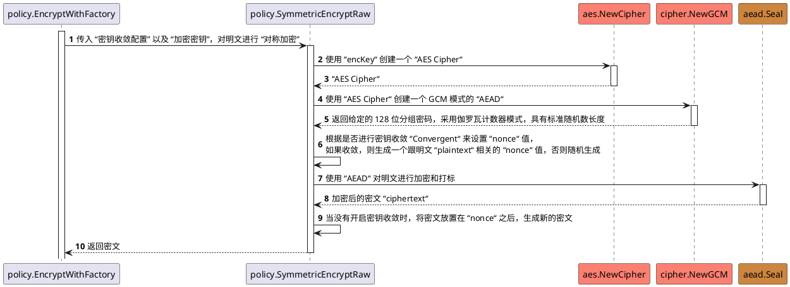

# 概述

## 1. 背景介绍
在上一篇文章中，我们已经对 Vault 里 Transit 秘密引擎的使用方式有了初步的了解，基本弄清了 Transit 引擎的基本使用方式。在本文中，我们将继续探索 Transit 引擎的基本实现原理，进一步去了解该秘密引擎的底层实现方式，并对一些基本操作的实现方式进行剖析。需要注意的是，本文的分析会聚焦于核心流程，因此会忽略登陆的流程，以及其它非关键步骤。

## 2. 前置问题

在开始之前，需要设置几个前置的问题，以此保证我们不会迷失在茫茫的源码海洋中。

- 为什么每次加密获取到的密文均不同，但均可正常解密？

## 版本信息
- **v1.15.x**

# 相关技术介绍

## AEAD
AEAD 的全称为 “Authenticated Encryption with Associated Data”（携带关联数据的加密认证），是一种同时具备保密性，完整性和认证性的安全加密协议，提供了保护数据不被未授权者访问的加密功能，同时具备验证数据未被篡改的认证能力。

协议主要包括两个部分，AE “Authenticated Encryption”（认证加密）和 AD “Associated Data”（关联数据），分别负责数据的认证加密和完整性保障。通过在加密操作中对 “加密数据” 和 “关联数据” 生成一个认证标签 MAC，然后在解密操作中对其进行验证，为加密算法提供了防篡改保护。同时，如果认证失败，即 “关联数据” 或 “认证标签” 被篡改，解密操作将被阻断，以此来保证数据的完整性和机密性。

- **AE “Authenticated Encryption”**：该部分提供了能够保证机密性和完整性的加密模式，确保消息内容在没有被篡改的情况下保持机密状态，通常结合 “加密算法” 和 “消息认证码算法” 进行实现；
- **AD “Associated Data”**：该部分在整个传输的过程中均会以明文的形式存在，在加解密的过程中，不会对其进行加密和解密处理，因此外部的观察者可以看到这部分数据，但任何尝试对其进行修改的操作，都会被消息接收方在验签时发现；

## AES-GCM

## HMAC
HMAC 全称为 “Hash-based Message Authentication Code”（基于哈希的消息认证码），是一种用于消息认证的计算机安全技术。通过结合加密散列函数和一个密钥，来实现对消息完整性和真实性的校验。其主要用途是确保数据在传输过程中未被篡改，并验证消息发送者的身份。其主要工作流程如下所述。

### 工作流程
1. 选择一个加密散列函数，如 SHA-256、SHA-1 或 MD5 等；
2. 选取一个秘密密钥，该密钥只有消息的发送者和管理者才知晓；
3. 将 “待发送的消息” 和 “密钥” 输入到 HMAC 算法中，算法会输出一个固定长度的哈希值 HMAC；
4. 将刚刚生成的 HMAC 与消息一同进行发送；
5. 接收方接收到消息后，使用同样的 “密钥” 和 “散列函数” 生成一个新的 HMAC，并将这个新生成的 HMAC 与接收到的 HMAC 进行比较，如果两者一致，则认为消息在传输的过程中未被篡改，且消息确实来自于拥有密钥的发送者；

这里需要注意的是第五步，在该步的验证中，其实是同时完成对消息完整性和真实性的校验。一方面，当消息在传输时被中途篡改，那 HMAC 会发生变化，所以验证过程完成了对消息的完整性的校验，另一方面，只有使用相同的密钥和散列函数，才能对同一个消息产生同样的 HMAC，因此这也完成对密钥身份的真实性校验。

### 算法描述
1. **准备初始密钥**：初始密钥用于生成后续的 “内部密钥” 和 “外部密钥”。将 “输入密钥” 处理成与 “哈希函数块” 大小相同的长度，如果 “输入密钥” 长度短于块大小，则用零来填充，将填充后的结果作为 “初始密钥”。而如果 “输入密钥” 的长度超过块大小，则使用哈希函数对密钥进行散列，得到一个与块大小相同的值，将其作为 “初始密钥”；
2. **创建填充**：生成两个固定的字符串，分别作为 “内部填充（inner pad，ipad）” 和 “外部填充（outer pad，opad）”；
3. **创建内外密钥**：将 “内外填充” 分别与 “初始密钥” 进行 “按位或（XOR）” 计算，生成两个新的字符串，即为内外密钥；
4. **内部哈希计算**：将 “内部填充” 与 “原始消息” 串联起来，形成一个新的消息字符串，然后使用哈希函数对这个新的消息字符串进行散列，生成一个 “散列值”；
5. **外部哈希计算**：将 “外部填充” 与刚才生成的 “散列值” 串联起来，形成一个新的字符串，再使用哈希函数对这个新的字符串进行散列，此时获取到的散列值就是 HMAC；

# 原理分析

## 加密原理剖析

### 1. 客户端：发起加密请求

在这里，我们继续使用上一篇文章中的示例来进行分析。首先，由上文的操作可知，当我们需要对一个明文进行加密时，需要基于 `vault write` 命令，携带待加密的明文 `plaintext` 参数，向 `transit/encrypt/:name` 资源路径下写入一个加密请求。当加密操作顺利完成后，命令行会将加密后的结果返回给调用方，其中包括加密后的密文 `ciphertext`，也包括本次加密所使用到的密钥版本 `key_version`。

```shell
$ vault write transit/encrypt/my-key plaintext=$(echo "my secret data" | base64)

Key           Value
---           -----
ciphertext     vault:v1:bc8P0JF//GQotEAld/x7YNwCqLLUVnfB4HSGSJk5JzUsmRdJfh7uotGN4w==
key_version    1
```

首先，我们需要了解，在 Vault 的服务架构设计中，客户端与服务端是通过 HTTP/S 请求来进行数据传输的。因此，当我们从命令行进行一个数据加密操作时，其本质上是 Command 客户端对 Server 服务端发起了一次 HTTP/S 的远程 API 调用。

在 Vault 的源码中，这部分的逻辑在 `vault/command/write.go` 文件里，核心函数为 `*WriteCommand.Run`。聚焦函数的核心逻辑，该函数主要完成了以下几个关键步骤：

1. **参数解析及校验**：解析关键的 `path` 和 `data` 参数，其中 `path` 即为我们要进行操作的资源路径，而 `data` 则为相应的请求参数。在当前场景下，`path` 是 `transit/encrypt/my-key`，而 `data` 是 `plaintext=...`；
   
2. **发起网络请求**：基于 `Client` 携带参数发起 HTTP/S 远程网络请求；
   
3. **解析请求响应**：对加密请求的响应进行解析，并将结果输出到命令中；

### 2. 服务端：解析加密请求

因为 Vault 的服务端是基于 HTTP/S 进行构建的，所以我们可以找到统一的服务地址注册。对于 Transit 引擎来说，其服务端的服务地址注册集中在 `vault/builtin/logical/transit/backend.go` 文件中，而加密操作的地址处理逻辑则集中在 `./path_encrypt.go` 文件里。

在 `./path_encrypt.go` 文件的 `*backend.pathEncrypt` 函数中，对加密服务的路径、参数和回调进行了详细的定义，路由器可以根据该定义来对加密的请求进行路由，并将请求转发至真正的请求处理器 `*backend.pathEncryptWrite` 中进行处理。

### 3. 服务端：处理加密请求

这一部分是加密请求的核心处理逻辑，将抛开非重点的校验和处理细节，主要聚焦在核心的处理流程上。处理的流程从上一节结束的 `*backend.pathEncryptWrite` 方法开始，首先会从请求的参数结构体 `*framework.FieldData` 中解析参数，并对参数的合法性仅仅校验。

而后，将会获取加解密操作的核心对象 `*keysutil.Policy`，该对象是后续所有加密操作的核心对象，对象内保存着本次加密所需的关键参数。这里需要注意的是，当我们构造获取 Policy 对象的请求参数时，会发现本次的操作类型 `*logical.Request.Operation` 为 `logical.UpdateOperation`，而非 `logical.CreateOperation`，这意味着本次加密操作，本质是一个更新操作，而非一次创建操作。

当获取到 `*keysutil.Policy` 对象后，我们就可以通过调用该对象的 `EncryptWithFactory` 方法，来执行实际的加密操作。首先，对传入的数据进行 Base64 解码，获取到原始的明文数据，然后再通过调用 `GetKey` 方法，来获取指定版本的密钥 `KeyEntry.Key`，该密钥将作为后续对称加密使用的密钥。最后，通过调用 `SymmetricEncryptRaw` 方法，传入密钥版本、加密密钥、明文和对称加密参数，来对明文执行对称加密操作。


执行完 `SymmetricEncryptRaw` 方法后，将获取到对称加密后的密文，然后再对齐进行 Base64 编码，并为编码后的数据前置增加密钥的 “版本” 信息。最终，构造响应结构体，并返回加密后的密文和其使用的密钥版本。

#### 同步加密原始数据（SymmetricEncryptRaw）

概括来说，`SymmetricEncryptRaw` 方法主要执行的操作，是使用传入的加密密钥来构造 `GCM` 实例，并基于传入的对称加密参数，来生成 `GCM` 模式所需的 `nonce`，从而对传入的明文进行 `Seal` 密封操作，生成最终的密文。其具体流程如下所示。

首先是加密组件的初始化工作，对应下图中的第 1～5 步。获取 AES 密钥，这里的 AES 密钥就是方法调用时传入的 `encKey` 参数，然后通过 `aes.NewCipher` 使用 AES 密钥构造 AES 块实例 `aesCipher`。通过 `cipher.NewGCM` 使用 AES 块实例 `aesCipher` 构造 GCM 实例 `gcm`。

生成加密使用的 `nonce` 值，对应下图中的第 6 步。当未设置密钥收敛（请求参数中的对称加密设置 `opts.Convergent` 为 `false`），且没有指定 `nonce` 参数时，随机生成 12 字节的 `nonce` 进行加密，否则基于明文的内容来生成 `nonce`。默认设置下，每次加密使用的 `nonce` 均不同，所以当没有指明 `nonce` 参数时，每次生成的 `nonce` 都是随机的，这也使得对同一个明文进行多次加密时，哪怕使用的是同一个密钥，也会出现每次加密获取到的密文均不同的情况。而当开启了密钥收敛配置，且设置了 `nonce` 时，则会使用 HMAC 算法，基于明文的内容生成一个固定的 `nonce` 值。

对明文进行加密和打标操作，对应下图中的第 7～ 10 步。使用 GCM 实例 `gcm` 通过 `gcm.Seal` 方法来对明文进行加密并添加认证标签，获取到加密后的密文。在未开启密钥收敛配置时，将生成的密文追加到随机生成的 `nonce` 后，作为最终的密文进行返回，否则直接将加密后的密文返回。




## 解密原理剖析


# 参考文档

【1】[Developer Secret Engines - Transit Secrets Engine](https://developer.hashicorp.com/vault/docs/secrets/transit)

【2】[API Secret Engines - Transit: Encrypt Data](https://developer.hashicorp.com/vault/api-docs/secret/transit#encrypt-data)