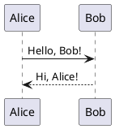

# 概述

## 1. 背景介绍
在上一篇文章中，我们已经对 Vault 里 Transit 秘密引擎的使用方式有了初步的了解，基本弄清了 Transit 引擎的基本使用方式。在本文中，我们将继续探索 Transit 引擎的基本实现原理，进一步去了解该秘密引擎的底层实现方式，并对一些基本操作的实现方式进行剖析。需要注意的是，本文的分析会聚焦于核心流程，因此会忽略登陆的流程，以及其它非关键步骤。

## 2. 前置问题

在开始之前，需要设置几个前置的问题，以此保证我们不会迷失在茫茫的源码海洋中。

- 为什么每次加密获取到的密文均不同，但均可正常解密？

## 版本信息
- **v1.15.x**

# 相关技术介绍

## AES-GCM

# 原理分析

## 加密原理剖析

### 1. 客户端：发起加密请求

在这里，我们继续使用上一篇文章中的示例来进行分析。首先，由上文的操作可知，当我们需要对一个明文进行加密时，需要基于 `vault write` 命令，携带待加密的明文 `plaintext` 参数，向 `transit/encrypt/:name` 资源路径下写入一个加密请求。当加密操作顺利完成后，命令行会将加密后的结果返回给调用方，其中包括加密后的密文 `ciphertext`，也包括本次加密所使用到的密钥版本 `key_version`。

```shell
$ vault write transit/encrypt/my-key plaintext=$(echo "my secret data" | base64)

Key           Value
---           -----
ciphertext     vault:v1:LxLIHRN8sRdZ0t8dQPZ4CcgRKM9mdRZ89iAPV3+GKF6r2YiremX/JEq+BQ==
key_version    1
```

首先，我们需要了解，在 Vault 的服务架构设计中，客户端与服务端是通过 HTTP/S 请求来进行数据传输的。因此，当我们从命令行进行一个数据加密操作时，其本质上是 Command 客户端对 Server 服务端发起了一次 HTTP/S 的远程 API 调用。

在 Vault 的源码中，这部分的逻辑在 `vault/command/write.go` 文件里，核心函数为 `*WriteCommand.Run`。聚焦函数的核心逻辑，即该函数主要完成了以下几个关键步骤：

1. **参数解析及校验**：解析关键的 `path` 和 `data` 参数，其中 `path` 即为我们要进行操作的资源路径，而 `data` 则为相应的请求参数。在当前场景下，`path` 是 `transit/encrypt/my-key`，而 `data` 是 `plaintext=...`；
   
2. **发起网络请求**：基于 `Client` 携带参数发起 HTTP/S 远程网络请求；
   
3. **解析请求响应**：对加密请求的响应进行解析，并将结果输出到命令中；

### 2. 服务端：解析加密请求

因为 Vault 的服务端是基于 HTTP/S 进行构建的，所以我们可以找到统一的服务地址注册。对于 Transit 引擎来说，其服务端的服务地址注册集中在 `vault/builtin/logical/transit/backend.go` 文件中，而加密操作的地址处理逻辑则集中在 `./path_encrypt.go` 文件里。

在 `./path_encrypt.go` 文件的 `*backend.pathEncrypt` 函数中，对加密服务的路径、参数和回调进行了详细的定义，路由器可以根据该定义来对加密的请求进行路由，并将请求转发至真正的请求处理器 `*backend.pathEncryptWrite` 中进行处理。

### 3. 服务端：处理加密请求

这一部分是加密请求的核心处理逻辑，将抛开非重点的校验和处理细节，主要聚焦在核心的处理流程上。处理的流程从上一节结束的 `*backend.pathEncryptWrite` 方法开始，首先会从请求的参数结构体 `*framework.FieldData` 中解析参数，并对参数的合法性仅仅校验。

而后，将会获取加解密操作的核心对象 `*keysutil.Policy`，该对象是后续所有加密操作的核心对象，对象内保存着本次加密所需的关键参数。这里需要注意的是，当我们构造获取 Policy 对象的请求参数时，会发现本次的操作类型 `*logical.Request.Operation` 为 `logical.UpdateOperation`，而非 `logical.CreateOperation`，这意味着本次加密操作，本质是一个更新操作，而非一次创建操作。

当获取到 `*keysutil.Policy` 对象后，我们就可以通过调用该对象的 `EncryptWithFactory` 方法，来执行实际的加密操作。首先，对传入的数据进行 Base64 解码，获取到原始的明文数据，然后再通过调用 `GetKey` 方法，来获取指定版本的密钥 `KeyEntry.Key`，该密钥将作为后续对称加密使用的密钥。最后，通过调用 `SymmetricEncryptRaw` 方法，传入密钥版本、加密密钥、明文和对称加密参数，来对明文执行对称加密操作。

`SymmetricEncryptRaw` 方法，主要执行的操作，就是使用传入的加密密钥来构造 `GCM` 实例，并基于传入的对称加密参数，来生成 `GCM` 模式所需的 `nonce`，从而对传入的明文进行 `Seal` 密封操作，生成最终的密文。其具体流程如下所示。

1. 使用对应版本的密钥生成 AES 密钥，通过 `aes.NewCipher` 使用 AES 密钥构造 AES 块实例 `aesCipher`，再通过 `cipher.NewGCM` 使用 `aesCipher` 构造 GCM 实例 `gcm`；
2. 当没有指定 `nonce` 参数时，随机生成 12 字节的 `nonce` 进行加密（这里就是每次加密不收敛的原因所在，当没有指明 `nonce` 参数时，每次生成的 `nonce` 都是随机的）
3. 使用 GCM 实例 `gcm` 通过 `gcm.Seal` 方法来对明文进行加密并添加认证标签，并获取到最终的密文
4. 在不收敛时 `SymmetricOpts.Convergent == false`，将生成的密文追加到 `nonce` 后面，作为新的密文进行返回；

执行完 `SymmetricEncryptRaw` 方法后，将获取到对称加密后的密文，然后再对齐进行 Base64 编码，并为编码后的数据前置增加密钥的 “版本” 信息。最终，构造响应结构体，并返回加密后的密文和其使用的密钥版本。



## 解密原理剖析


# 参考文档

【1】[Developer Secret Engines - Transit Secrets Engine](https://developer.hashicorp.com/vault/docs/secrets/transit)

【2】[API Secret Engines - Transit: Encrypt Data](https://developer.hashicorp.com/vault/api-docs/secret/transit#encrypt-data)