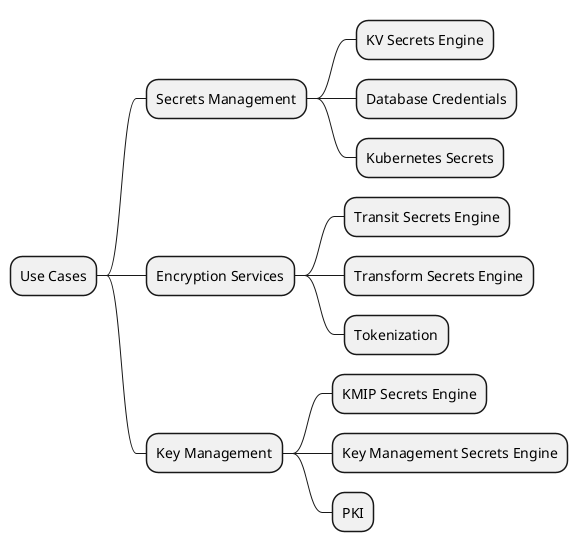
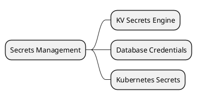
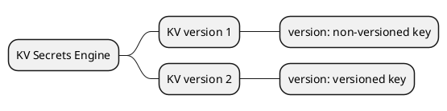
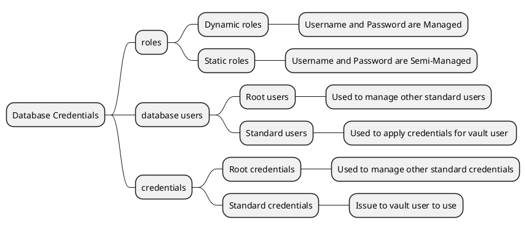
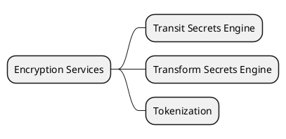
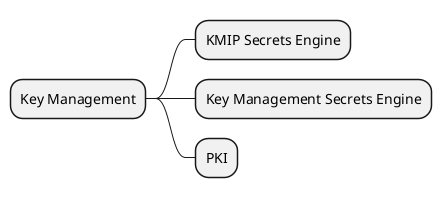

# 使用场景

## 1. Secrets Management（秘密管理）

### 1.1 KV Secrets Engine（KV 秘密引擎）
> A generic Key-Value store used to store arbitrary secrets within the configured physical storage for Vault.

通用的键值秘密存储引擎，用于将任意秘密保存到插件化配置的 Vault 物理存储中。该服务可以在两种不同的模式下运行，在一种模式下，将仅存储密钥的单个版本，而在另一种模式下，可以通过启用版本控制，来为每个密钥存储一定数量的历史版本。

#### KV version 1（非版本化模式）
当服务在模式一下运行时，引擎只会保留最近一次写入的密钥值，可以将该模式简单理解为是一个 “非版本化” 的模式。在 “非版本化” 的模式下，因为不会对密钥的历史版本进行存储，也无需额外存储用于维护版本的元数据，所以能够有效的降低密钥存储的大小。同时，因为减少了版本信息的维护，这使得服务端对于任何给定的请求，都能够最大限度的降低对底层存储的调用及锁定，从而将使得整个服务具有更高的性能。

#### KV version 2（版本化模式）
模式二与模式一刚好相反，模式二为 “版本化模式”，当引擎运行在模式二的配置下时，默认会存储 10 个版本的密钥历史版本，并支持对旧版本密钥的数据（元数据及密钥数据）进行检索，通过 “校验再更新” 的方式，也能够避免无意中对旧版本的密钥造成覆盖。

当对密钥的历史版本进行删除时，实际执行的是软删除操作，即将待删除的密钥标记为 “已删除”，后续可以通过 “撤销删除” 的方式，来对已删除的密钥进行恢复。而如果要物理永久的删除密钥，需要通过调用指定的 destroy 命令或 API 来实现，并且软删除、撤销删除以及永久删除，均有独立的 ACL 访问权限控制。

### 1.2 Database Credentials（数据库凭证）
数据库机密引擎根据配置的角色，动态生成数据库凭据，并通过插件化的形式实现对不同数据库的适配。服务提供了一些内置的数据库机密引擎插件，同时也支持开发者通过开发和运行自定义的数据库插件，来扩展实现对其它数据库的支持。

通过使用该服务，实体访问数据库服务就不再需要对凭证进行硬编码，仅需在需要使用凭证的时候，动态的对引擎服务发起请求来获取这些凭据。同时，由于每个服务（用户）均使用唯一的凭据来访问数据库，因此在发现数据库出现异常访问时，可以根据 SQL 用户名直接追踪到具体服务的特定实例，这大大提升了 “审计” 的准确性和效率。

针对不同的使用场景，Vault 分别提供了两种角色：动态角色和静态角色。
- **动态角色**：可以理解为是一种 “全托管” 方案，即由 Vault 全权负责数据账号密码的生命周期管理，适用于短时间的临时使用场景。
- **静态角色**：可以理解为是一种 “半托管” 方案，由管理员将已有的账号托管给 Vault 进行管理，Vault 可以按照管理员的设置，定期对账号的密码进行轮转替换，但是不会对账号自身进行变更，静态角色更适合长期使用的场景。

同时，Vault 也对数据库用户和数据库凭证进行了区分，定义了两种不同用途的用户和凭证。
- **Root 用户**：该用户由 Vault 用户管理员进行创建，并将其配置给 Vault 进行使用，属于管理者用户，其对应的凭证为 “Root 凭证”，Vault 将使用该用户进行数据库凭据的 “创建/更新/删除” 等操作，因此该用户需要具有对其他数据库用户的操作权限。
- **Standard 用户**：在 “动态角色” 场景下，该用户由 “Root 用户” 创建，而在 “静态角色” 场景下，该用户由管理员进行配置，其主要的用途是生成可供 vault 用户直接使用的生产凭证，因此会被定义轮转，其对应的凭证为 “Standard 凭证”。

#### Dynamic roles（动态角色：全托管）
服务提供了 “租约机制（leasing mechanism）” 来对凭证的动态轮转提供了支持，在该场景下生成的角色和秘密一般被称为 “动态角色” 或 “动态秘密”，服务会通过自己内部的 “租期维护机制” 及 “凭证撤销机制”，在用户租约到期后的 “合理时间” 内，对其进行权限失效操作。

#### Static roles（静态角色：半托管）
Vault 对所有的数据库机密引擎都提供了静态角色功能，静态角色是 Vault 角色与数据库用户名的一对一映射，通过引入静态角色，机密服务可以根据配置的时间段或轮转计划，来存储并自动轮转关联数据库用户的密码。

当客户端请求静态角色的凭据时，机密服务会返回映射到请求角色的数据库用户的当前密码，通过使用静态角色，任何拥有适当 Vault 策略的实体，都可以访问静态角色在数据库中关联的用户账户。

#### 动态角色和静态角色的区别

|     | 动态角色  | 静态角色  |
|  ----  | ----  | ----  |
| 账号管控 | 每当请求凭证时，Vault 都会在数据库中创建一个全新的账号，并在凭证到期时，自动注销该账号，因此账号的生命周期是与凭证的有效期相绑定的 | 账号是预先存在的，或者是由管理员手动创建的，Vault 不会创建或销毁账号，而是对这些静态账号的凭证（用户名和密码）进行管理，在设定的轮换周期上更新它们 |
| 凭证轮转 | 因为每次都会创建新的账号和密码，并且在使用完毕后即销毁，所以不需要轮换凭证 | Vault 会定期轮换静态账号的密凭证，也就是更新账号的密码，以确保即使凭证被泄露，也只会在一个较短的时间窗口内存在风险 |
| 使用场景 | 适用于需要短期访问的场景，比如临时任务、一次性操作或服务的自动扩展等。在这些场景下，动态角色能够提供快速、安全的访问，并且在使用完毕后及时对账号进行清理 | 适用于需要长期存在和访问数据库的场景，比如专门的服务账号或持久化的应用账号。静态角色允许长期控制账号，并通过周期性轮转凭证，来保证安全性 |
| 权限变更 | 每次创建的账号都可以有不同的权限集，允许每个凭证请求特定的权限 | 由于账号是预先存在的，所以权限通常是在创建的时候设置的，不会随着凭证的轮换而改变 |

动态角色适合短暂、临时或高变动性的数据库访问需求，以此提供更高的安全性和灵活性。而静态角色更适合固定’长期的数据库访问需求，通过凭证轮转提供安全保障，同时避免频繁的创建和销毁数据库账号，降低相关的操作开销。

### 1.3 Kubernetes Secrets（K8s 秘密）
Vault 支持通过官方的 HashiCorp Vault Helm 将 Vault 部署到 K8s 集群中，分别可以通过开发模式、独立模式、高可用模式和外部模式进行部署。

|     | 数据存储  | 部署方式  | 使用场景  |
|  ----  | ----  | ----  | ----  |
|  开发模式（Dev）  | 本地内存  | 单服务器部署  | 开发测试  |
|  独立模式（Standalone）  | 本地文件系统  | 单服务器部署  | 生产环境  |
|  高可用模式（High-Availability）  | 高可用存储（如 Consul）  | 集群部署  | 生产环境  |
|  外部模式（External）  | 外部服务器存储  | 单服务器部署  | 生产环境  |

## 2. Encryption Services（加密服务）

### 2.1 Transit Secrets Engine（数据传输秘密引擎）
该引擎是 Vault 提供的一个用于对被传输数据进行加解密的秘密引擎，它不会对加解密的数据进行存储，而仅仅是作为一种 “加密即服务（Encryption as a Service，EaaS）” 的服务提供者，并提供了对数据进行签名和验证的功能。

该引擎的主要目标，是将待传输数据的加解密工作，从应用的主体业务中剥离出来，降低业务主体的复杂度，同时提升加解密服务的可复用性和稳定性。

同时，Transit 秘密引擎还支持 “密钥派生” 功能，即能够通过用户提供的上下文，来 “派生” 出相应的新密钥，并将其分别应用到不同的场景中。默认设置下，密文的生成是不收敛的，即同一个明文多次加密，每次都会生成不同的密文，但你也可以选择进行 “收敛加密”，即允许对相同的明文产生相同的密文。

#### Convergent encryption（收敛加密）
“收敛解密” 是数据传输秘密引擎提供的一种加密模式，在该模式下，同一组明文和上下文，在加密后总是能够产生相同的密文。该模式的实现方案是通过一个密钥派生函数，针对相同的明文派生确定且相同的随机数来实现。

该模式常见的一种实际使用场景，是对于加密数据的高效检索。当多份数据被加密后存储至数据库中，通过对待检索数据的加密，然后使用检索数据的密文到数据库中进行检索，能够有效提升加密数据的检索效率。否则，查询者只能通过遍历解密的方式，才能实现数据的检索。

目前该模式提供了三个版本：
1. **版本一**：要求客户端自己提供随机数，这样的方式增加了方案的灵活性，但当操作不当的时候可以能会出现随机数重复等问题，带来数据安全风险；
2. **版本二**：服务端基于特定的算法来生成随机数。然而，该版本的算法比较容易受到 “离线明文确认” 攻击，如果明文长度很短，攻击者可能会实现暴力破解。
3. **版本三**：使用不同的生成算法，旨在抵御 “离线明文确认” 攻击，实现的方案与 “AES-SIV” 类似，即使用 “PRF” 来从明文中生成随机数。

### 2.2 Transform Secrets Engine（秘密转换引擎）
Transform Secrets Engine 是一个用于保护敏感数据的秘密引擎，它通过对数据进行编码和解码，来实现数据的保密性和完整性。与数据传输加密引擎（Transit Secrets Engine）相比，秘密转换引擎（Transform Secrets Engine）提供了更为复杂的数据保护能力，如数据脱敏和数据遮蔽等，能够满足更加多样化的数据安全需求。而数据传输加密引擎（Transit Secrets Engine），则更注重对数据传输提供端对端的加密保护。

其核心提供了以下几种能力：
1. **数据加密（Encryption）**：通过使用安全的加密算法，基于密钥将明文加密为密文，从而保证数据的安全性；
2. **数据解密（Decryption）**：对于已加密的密文，秘密引擎可以对其进行解密操作，将密文还原为明文数据；
3. **数据脱敏（Tokenization）**：数据脱敏是将敏感数据转换为非敏感的代替数据（Token）的过程，代替数据本身不包含任何敏感信息，但可以在需要时被 “映射” 回原始数据；
4. **数据遮蔽（Masking）**：数据遮蔽即对数据进行部分的隐藏，如只显示信用卡号的后四位。数据遮蔽可以用来在不泄漏全部信息的情况下，完成对数据的展示和验证流程；
5. **格式保留加密（Format-Preserving Encryption，FPE）**：格式保留加密允许再数据加密时，保留原始数据的格式，比如在加密信用卡号时，加密后的数据仍符合信用卡卡号的格式；

### 2.3 Tokenization（数据脱敏）
令牌化（Tokenization）与 Vault 令牌（Vault token）不同，令牌化是将敏感值转换为称为令牌的非敏感值，且该操作为不可逆操作，即原始敏感值无法仅从令牌中被恢复。同时，与保留格式的加密不同，标记化是有状态的，要解码原始数据，必须将令牌提交到 Vault，才能从存储的加密映射中，检索出令牌对应的原始数据。

#### Operation（实现方式）
在编码时 Vault 会生成一个随机的签名令牌，并存储该令牌到明文和元数据的加密版本的映射，同时也会对原始明文的指纹进行存储，以此便于查询令牌化的明文是否存在于系统中。根据映射模式，明文只能在拥有分布式令牌的情况下才能被解码，或者在导出操作中恢复。

#### Convergence（标记收敛）
默认情况下，Tokenization 为每次编码操作生成一个唯一的标记，此时生成的令牌完全独立于其明文和过期时间，但在某些情况下，可能需要将相同的明文和过期时间，统一标记为相同的令牌。比如，如果想要对令牌进行统计分析，同时期望不对令牌进行解码，或者希望令牌能够同时在两个不同的系统中进行相互关联。此时，可以创建一个收敛的标记化转换。

当启用收敛的标记转化后，Vault 会更改算法，对相同的明文和过期时间，标记化编码为相同的令牌，并且仅存储保留该标记的单个条目。标记收敛在使用外部存储模式时，具有较小的性能损失，但在内置存储时则具有较大的性能损失，这主要是因为在收敛编码时，需要避免重复条目并更新元数据。因此建议如果某些用例需要收敛，而另一些则不需要，此时应创建两个不同的标记化变换，并且仅在其中一个上启用收敛配置。

## 3. Key Management（密钥管理）

### 3.1 KMIP Secrets Engine（KMIP 秘密引擎）
KMIP 机密引擎允许 Vault 充当密钥管理互操作性协议 [Key Management
Interoperability Protocol][kmip-spec] (KMIP) 服务器提供商，并处理其 KMIP 托管对象的生命周期。KMIP 是一种标准化协议，允许服务和应用程序在不将其存储和生命周期委托给密钥管理服务器的情况下，实现加密材料（也称为托管对象）的管理和加密的操作。

### 3.2 Key Management Secrets Engine（密钥管理秘密引擎）
密钥管理机密引擎对各厂商的密钥管理服务 (KMS) 提供统一的管控界面，为加密密钥的分发和生命周期管理提供一致的工作流程。并允许管理员在 Vault 中对其密钥进行集中的管控，并在底层实现上仍使用各厂商 KMS 服务提供的本机加密功能。

秘密引擎生成并拥有密钥材料的原始副本，当操作者决定使用受支持的 KMS 服务，进行密钥生命周期的管理和分发时，将分发密钥材料的副本，这为 KMS 供给应用程序使用密钥的流程，提供了额外的快恢手段。密钥材料将始终根据 KMS 的密钥导入规范进行安全传输。

### 3.3 PKI（公钥基础设施）
PKI 秘密引擎可以生成动态的 X.509 证书，通过该秘密引擎，服务可以直接获得证书，而无需经过通常所需的手动操作流程，即生成私钥和 CSR，再提交给 CA，然后等待验证和签名的过程完成。这是因为 Vault 内置的身份验证和授权机制提供了验证功能。 
 
通过保持相对较短的 ttl，降低需要撤销的可能性，从而保证 crl 也较短，帮助秘密引擎扩展到大型工作负载。这反过来又允许正在运行的应用程序，其每个实例均拥有唯一的证书，从而消除了证书共享以及随之而来的吊销和轮转成本。 
 
此外，通过允许大多数吊销操作被撤销，这个秘密引擎允许生成临时证书，且证书可以在应用程序启动时获取，并存储在内存中，并在关闭时丢弃，而不需要写入磁盘。

[kmip-spec]: http://docs.oasis-open.org/kmip/spec/v1.4/kmip-spec-v1.4.html

# 相关引用
【1】[Hashicorp Vault Use Cases](https://developer.hashicorp.com/vault/docs/use-cases)

【2】[Hashicorp Vault Documentation](https://developer.hashicorp.com/vault/docs)